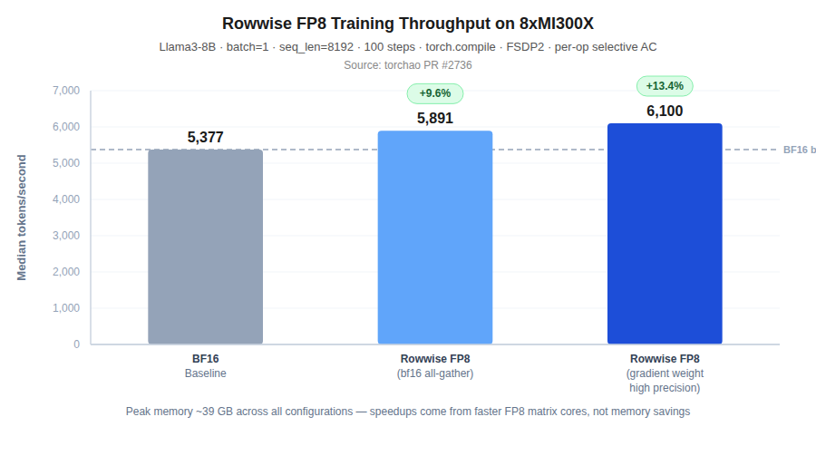
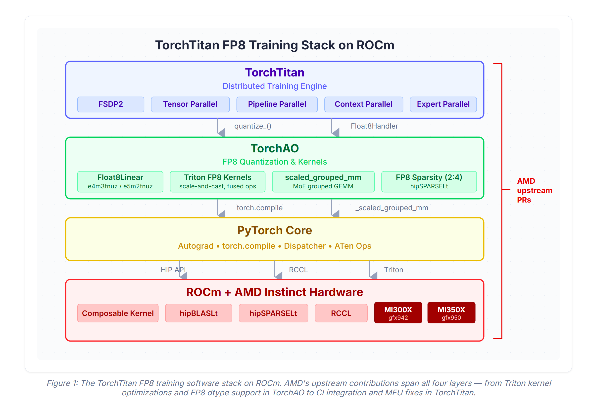
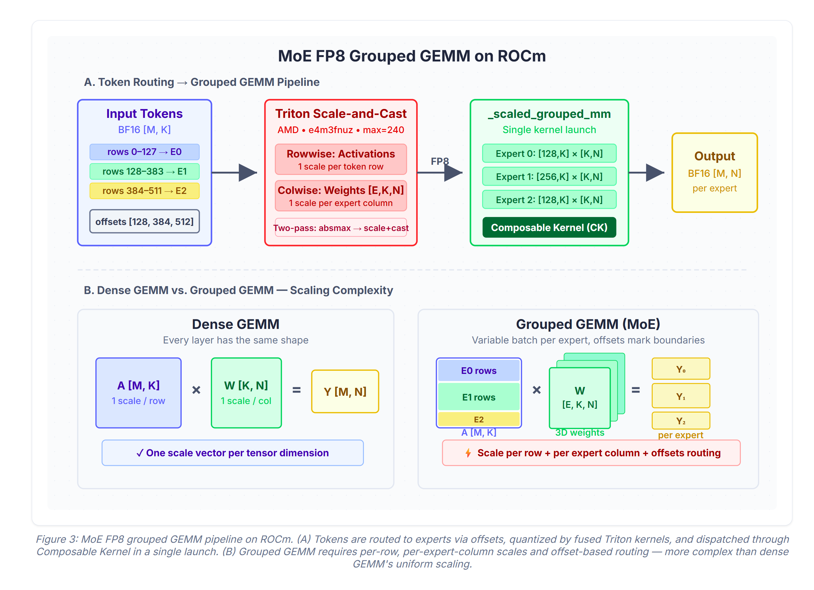
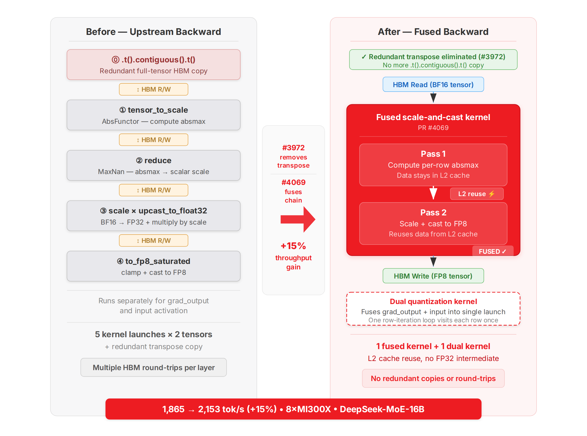
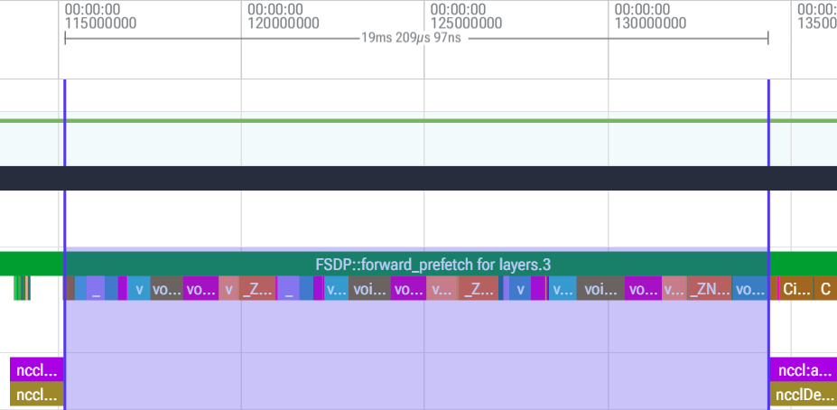
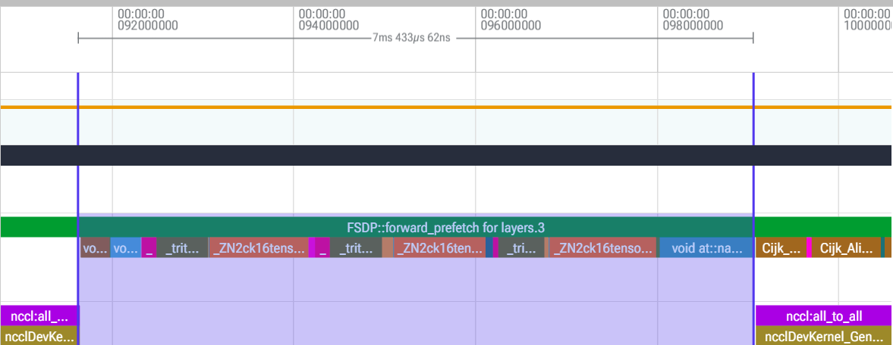
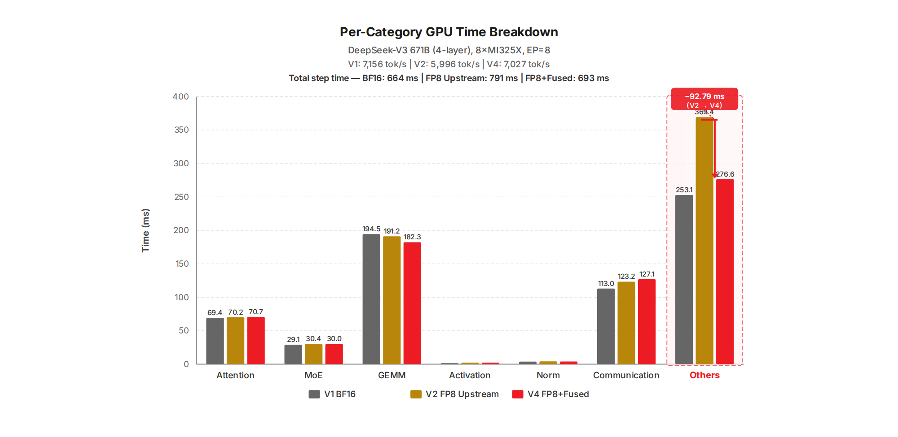

# FP8 Training on AMD GPUs with TorchTitan and TorchAO: From First Commit to Production Scale

**Author:**  Rishi Sinha (AMD)

---

At the PyTorch Conference 2026, we demonstrated linear scaling beyond 1,000 GPUs on AMD Instinct clusters using Primus-Turbo, AMD's optimization library for training frameworks like TorchTitan and Megatron. But a separate library was not the end goal. We have now upstreamed AMD optimizations so that TorchTitan can natively support AMD Instinct™ GPUs with competitive FP8 performance out of the box in upstream PyTorch.

Through fused Triton quantization kernels, we recovered 89% of the FP8 quantization overhead on DeepSeek-V3 671B MoE shapes, with individual kernel optimizations delivering up to a 6.2× speedup. On dense models, rowwise FP8 training with high-precision gradient weight delivers a 13.4% throughput gain over BF16 on Llama3-8B. All of this work is merged into mainline [pytorch/ao](https://github.com/pytorch/ao) and [pytorch/torchtitan](https://github.com/pytorch/torchtitan).

This blog traces that upstream effort: from hardware-aware FP8 support, through MoE grouped GEMM on ROCm, to the Triton kernel fusion pipeline that closed the performance gap.

*Figure 1: Rowwise FP8 training throughput on 8×MI300X with Llama3-8B (batch size 1, seq len 8192, 100 steps, torch.compile, FSDP2, per-op selective activation checkpointing). Rowwise FP8 with high-precision gradient weight delivers a 13.4% throughput gain over BF16, with peak memory nearly identical (~39 GB). The win comes from faster FP8 matrix cores, not memory savings. All numbers from torchao [PR #2736](https://github.com/pytorch/ao/pull/2736).*

## FP8 on AMD: Formats and First Fixes

AMD Instinct GPUs implement a variant of the FP8 formats called FNUZ (Finite, No NaN, Unsigned Zero). The primary difference is that e4m3fnuz has a maximum value of 240, compared to 448 for NVIDIA's e4m3fn.

| Property | e4m3fn (NVIDIA) | e4m3fnuz (AMD) |
|----------|----------------|----------------|
| Max value | 448 | 240 |
| NaN/Inf encodings | Yes | No |
| Hardware | H100, H200 | MI300X, MI325X, MI350X |

*Figure 2: The TorchTitan FP8 training software stack on ROCm. AMD's upstream contributions span all layers — from Triton kernel optimizations and FP8 dtype support in TorchAO to MFU fixes in TorchTitan.*

The torchao library initially hardcoded NVIDIA's e4m3fn dtype for all FP8 operations — on AMD hardware, this silently produced wrong results as scales were computed against a max of 448 when the hardware's actual max is 240. We fixed this in stages: torchao [#1142](https://github.com/pytorch/ao/pull/1142)/[#1150](https://github.com/pytorch/ao/pull/1150) added GPU auto-detection for FNUZ types, followed by hardware capability checks ([#1314](https://github.com/pytorch/ao/pull/1314)), OCP FP8 support ([#1677](https://github.com/pytorch/ao/pull/1677)), and correct quant dtype selection on AMD ([#2225](https://github.com/pytorch/ao/pull/2225)). On the TorchTitan side, we added correct AMD MI300X FLOPS values for MFU reporting ([#920](https://github.com/pytorch/torchtitan/pull/920)) and platform-specific loss baselines for FNUZ numerics ([#2156](https://github.com/pytorch/torchtitan/pull/2156)/[#2157](https://github.com/pytorch/torchtitan/pull/2157)).

FP8 scaling can be applied at different granularities: a single scale per tensor (tensorwise), a scale per row (rowwise), per fixed-size tile (blockwise), or per group packed alongside the data (MXFP8). All four are now supported on AMD through upstream PRs in torchtitan ([#153](https://github.com/pytorch/torchtitan/pull/153), [#808](https://github.com/pytorch/torchtitan/pull/808), [#1190](https://github.com/pytorch/torchtitan/pull/1190)) and torchao ([#3996](https://github.com/pytorch/ao/pull/3996)).

## Scaling FP8 to MoE Architectures

Mixture-of-Experts (MoE) models like DeepSeek V3 and Llama 4 route each token to a subset of experts, producing variable-size batches that must be processed through a grouped GEMM. Unlike dense models where every linear layer has the same shape, grouped GEMM requires per-row scales on activations, per-expert-column scales on weights, and an offsets tensor routing rows to the correct expert.

The PyTorch team built the MoE FP8 training infrastructure in TorchTitan ([#2774](https://github.com/pytorch/torchtitan/pull/2774), [#2842](https://github.com/pytorch/torchtitan/pull/2842), [#3032](https://github.com/pytorch/torchtitan/pull/3032)). Our contribution was making this work compatible on ROCm. We implemented FP8 rowwise quantization for `scaled_grouped_mm` on gfx942 ([#3955](https://github.com/pytorch/ao/pull/3955)), where fused Triton kernels handle the two-pass scale-and-cast (absmax then quantize to e4m3fnuz) and AMD's Composable Kernel (CK) backend executes all expert GEMMs in a single kernel launch. We also contributed correctness fixes for both ROCm and CUDA to handle the different max representable values and avoid integer overflows ([#3996](https://github.com/pytorch/ao/pull/3996), [#4016](https://github.com/pytorch/ao/pull/4016)).

*Figure 3: MoE FP8 grouped GEMM pipeline on ROCm. (A) Tokens are routed to experts via offsets, quantized by fused Triton kernels, and dispatched through Composable Kernel in a single launch. (B) Grouped GEMM requires per-row, per-expert-column scales and offset-based routing — more complex than dense GEMM's uniform scaling.*

## Triton Kernel Optimization

With correctness established, we turned to performance. The FP8 quantization pipeline in torchao converts tensors to FP8 through a multi-step chain:

1. Compute per-row/column absolute max (absmax)
2. Derive the scale factor and apply it
3. Clamp and cast to FP8

Each step is a separate kernel launch, and materializes an intermediate tensor to High Bandwidth Memory (HBM) between steps. For MoE models with dozens of expert weight tensors per layer, these extra round-trips dominate the FP8 overhead. We targeted optimization from multiple bottlenecks:

**Backward pass: removing redundant copies and fusing quantization.** The backward pass had two compounding problems. First, a `.t().contiguous().t()` pattern forced a full tensor copy through HBM to convert weight layout for GEMM compatibility. We removed these redundant copies in [#3972](https://github.com/pytorch/ao/pull/3972). Second, the multi-step scale-and-cast chain launched separate kernels with intermediate tensors materialized to HBM between them. We fused this chain into single Triton kernels in multiple places ([#4069](https://github.com/pytorch/ao/pull/4069)). On 8×MI300X with DeepSeek-MoE-16B, these backward fusions improved throughput from 1,865 to 2,153 tokens/second (15% performance increase).

*Figure 4: Backward-pass FP8 quantization before and after optimization. The upstream code launches five generic kernels per quantization call with a redundant transpose copy, materializing intermediate tensors to HBM between each. PR [#3972](https://github.com/pytorch/ao/pull/3972) eliminates the transpose, and PR [#4069](https://github.com/pytorch/ao/pull/4069) fuses the remaining chain into a single kernel with a companion dual-kernel for simultaneous grad_output + activation quantization — together delivering a 15% throughput gain on 8×MI300X.*

**Memory coalescing.** The colwise scales kernel used in the backward pass had non-coalesced memory writes ([#4113](https://github.com/pytorch/ao/pull/4113)) — consecutive SIMD lanes wrote to addresses K bytes apart, each triggering a separate memory transaction. We fixed this by transposing the output tile through LDS (Local Data Share) before storing, and added a fused single-pass variant that eliminates a redundant HBM read. On MI300X with DeepSeek-V3 671B shapes: 7,290μs → 1,170μs per MoE layer (**6.2× speedup**).

**Forward pass fusion.** The same multi-kernel pattern applied to the forward path. Quantizing expert weights launched five generic kernels per call — and with 24 calls per step, this added ~67 ms/step of overhead. We replaced the entire chain with a single fused Triton kernel ([#4311](https://github.com/pytorch/ao/pull/4311)) that parallelizes across both experts and output-dimension blocks. Collapsing five launches into one also cleared the execution queue for surrounding GEMMs to issue earlier. On 8×MI325X with DeepSeek-V3 671B: 5,996 → 7,027 tok/s vs 7,156 BF16 baseline — **recovering 89% of the quantization overhead**.

| Upstream FP8 (V2) | Fused FP8 (V4) |
|---|---|
|  |  |

*Figure 5: Perfetto trace comparison (8×MI325X, DeepSeek-V3 671B). Left: FP8 (before forward optimization) showing the 5-kernel eager chain repeated across experts. Right: fused FP8 (after optimization) showing a single `triton_fp8_colwise_3d_scale_and_cast` kernel replacing the chain. Performance in forward goes from ~19 ms to ~7 ms*

*Figure 6: Per-category GPU time breakdown across three configurations on 8×MI325X with DeepSeek-V3 671B (4-layer MoE). The FP8 upstream configuration (V2) adds 127 ms/step — 92% of which lands in "Others" (generic quantization kernels). The fused Triton kernel (V4) eliminates most of this overhead, recovering 89% of the BF16→FP8 gap.*

**Low-level GPU tuning.** We also addressed hardware-level inefficiencies. Triton's atomic operations (`atomic_add`, `atomic_max`, `atomic_min`) default to acquire-release memory ordering, which on AMDGPU inserts memory fences before and after every atomic — expensive synchronization points that are unnecessary for commutative reductions. We switched these to relaxed ordering on AMDGPU ([#3945](https://github.com/pytorch/ao/pull/3945)), guarded by a `torch.version.hip` check so NVIDIA behavior is unchanged.

**Autotuning Challenge.** We expanded the Triton autotune search space for MoE FP8 kernels from 1 to 8–16 candidate configurations ([#3952](https://github.com/pytorch/ao/pull/3952)), expecting the wider search to find faster tile sizes on AMD's wavefront-based architecture. It didn't as benchmarking on Llama 4 shapes on MI300X showed no measurable improvement, and the extra configs increased first-iteration compile time. We reverted it ([#4024](https://github.com/pytorch/ao/pull/4024)). The takeaway: autotuning search spaces should be shaped by hardware constraints (wavefront size, LDS capacity, register pressure), not expanded blindly. More configs does not always mean faster.

These kernel-level optimizations compound on top of the baseline FP8 throughput gains shown in Figure 1. On DeepSeek-V3 671B shapes, the forward-pass kernel fusion alone recovered 89% of the quantization overhead (5,996 → 7,027 tok/s vs 7,156 BF16 baseline on 8×MI325X), and the colwise scales optimization delivered a 6.2× speedup per MoE layer.

## Summary, and Next Steps

This blog traced the upstream engineering effort that brought FP8 training to AMD Instinct GPUs across torchao and torchtitan, solving challenges at every layer of the stack: teaching torchao's FP8 primitives about AMD's FNUZ formats and their different dynamic range, implementing FP8 grouped GEMM for MoE architectures through AMD's Composable Kernel backend, and systematically fusing Triton quantization kernels to close the performance gap.

Several areas of active development lie ahead. Tensorwise scaling optimizations for FP8 DeepSeek shapes are being upstreamed to close the gap with rowwise performance. We expected FP8 GEMM speedups to translate directly to end-to-end throughput gains, but FP8 introduces overhead in non-GEMM areas that partially offsets those savings, so isolating these sources is an active area of investigation. On next-generation hardware, we are developing MXFP8 grouped GEMM and quantization kernels for forward and backward passes on MI355X GPUs — results will follow in a future blog. The kernel fusion pipeline (#3972 → #4069 → #4113 → #4311) continues with further Triton optimizations.

This work was a collaboration between AMD and Meta/PyTorch engineers. All contributions are merged into mainline pytorch/ao and pytorch/torchtitan, ensuring that FP8 training on AMD GPUs works out of the box for the broader PyTorch community.

## Additional Resources

- [torchao float8 README](https://github.com/pytorch/ao/tree/main/torchao/float8) — includes benchmark reproduction instructions
- [torchtitan](https://github.com/pytorch/torchtitan)
- [torchtitan float8 docs](https://github.com/pytorch/torchtitan/blob/main/docs/float8.md)
- [AMD ROCm Documentation](https://rocm.docs.amd.com/)

## Disclaimers

Third-party content is licensed to you directly by the third party that owns the content and is not licensed to you by AMD. ALL LINKED THIRD-PARTY CONTENT IS PROVIDED "AS IS" WITHOUT A WARRANTY OF ANY KIND. USE OF SUCH THIRD-PARTY CONTENT IS DONE AT YOUR SOLE DISCRETION AND UNDER NO CIRCUMSTANCES WILL AMD BE LIABLE TO YOU FOR ANY THIRD-PARTY CONTENT. YOU ASSUME ALL RISK AND ARE SOLELY RESPONSIBLE FOR ANY DAMAGES THAT MAY ARISE FROM YOUR USE OF THIRD-PARTY CONTENT.

---
*© 2026 Advanced Micro Devices, Inc.*
